# The Ward

> Azure security operations lab for telemetry, detection engineering, identity defense, and incident response.

## Executive summary

The Ward is an Azure-first security operations lab focused on one core mission: turn cloud telemetry into actionable detections and investigations. The strongest proof point in this repo is a simulated T1098.003 privilege escalation case study in which a newly created account is assigned the Global Administrator role, the event is captured in Entra ID audit logs, and the activity is investigated through Sentinel, KQL, and incident workflow analysis.

This is the part of the project I want a recruiter, hiring manager, or reviewer to see immediately when they open the repo: the environment is not just configured, it is actively demonstrating detection engineering and identity defense in a realistic Azure lab.

## Featured project: T1098.003 privilege escalation investigation

### What happened

A low-privilege test account was assigned the Global Administrator role in the lab tenant. The event was then investigated end to end across:

- Entra ID audit logs
- Log Analytics ingestion
- Microsoft Sentinel detection logic
- KQL investigation
- alert creation and incident workflow
- containment and response documentation

### Why it matters

This is one of the most important identity attack paths in Azure security. A newly created or dormant account with permanent Global Administrator access is a classic persistence and privilege escalation pattern. It shows a realistic adversary path and a credible response workflow.

### Evidence included in the repo

The project includes screenshots and supporting material under `Simulated Priv Esc/` showing:

- Global Administrator assignment evidence
- the test account overview
- Sentinel analytics rule configuration
- KQL detection results
- raw `AuditLogs` validation
- incident creation and closure
- automation and playbook workflow
- the role-removal and account-disable steps during containment

This means the viewer does not have to click away to understand the project. The strongest story is already here.

### Follow-up: fixing the automated response

The first build left the block-user playbook unfinished: it ran green but never disabled anyone. I audited the deployment, found five bugs, and fixed them in the portal and PowerShell. On retest, the playbook disabled the test account 30 seconds after the incident was created, confirmed in Entra audit logs.

**Step 1: Audit.** The run history said Succeeded, but the playbook's identity had no Graph permissions, so it couldn't have disabled anyone.

**Step 2: Fix the entity mapping.** The rule put a UPN into the `AadUserId` slot, which expects the object ID the playbook uses to find the user. Before and after:

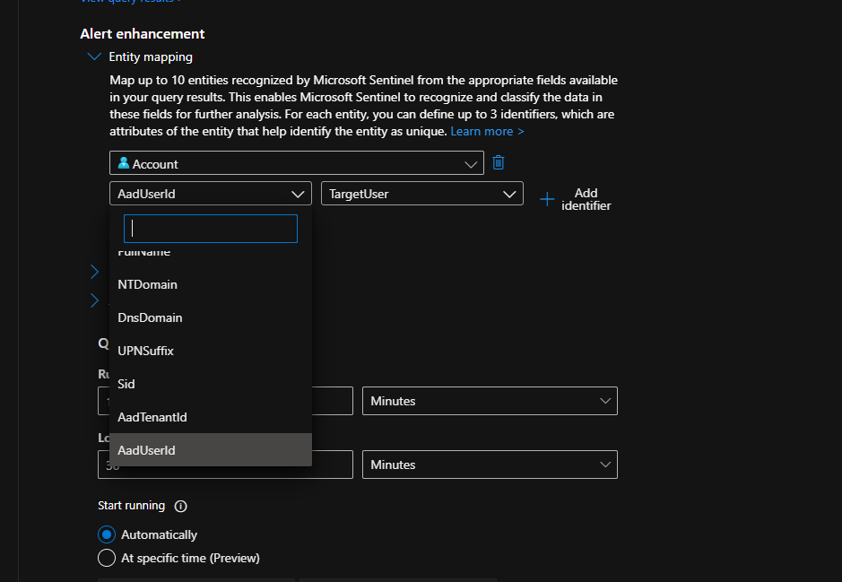

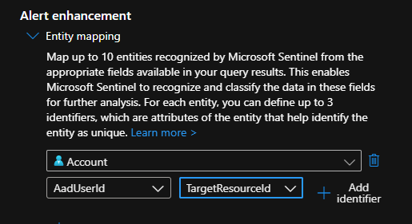

**Step 3: Fix the success comment.** It was being posted to a tenant ID instead of the incident. Fixed in the Logic App designer (the result shows in Step 9).

**Step 4: Scope the automation rule.** It had no conditions, so the block-user playbook would have run on every incident. Now it only runs for the privilege escalation rule. Before and after:

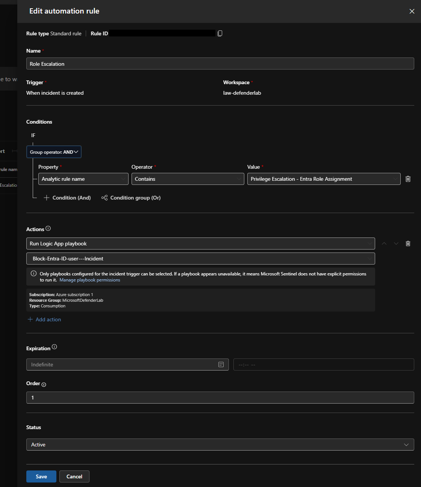

**Step 5: Grant Graph permissions.** `User.EnableDisableAccount.All` and `User.Read.All` on the managed identity, through Microsoft Graph PowerShell.

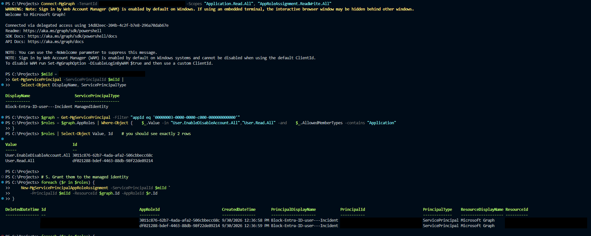

**Step 6: Narrow the Sentinel role.** Replaced Sentinel Contributor and Playbook Operator on the resource group with Sentinel Responder on the workspace only.

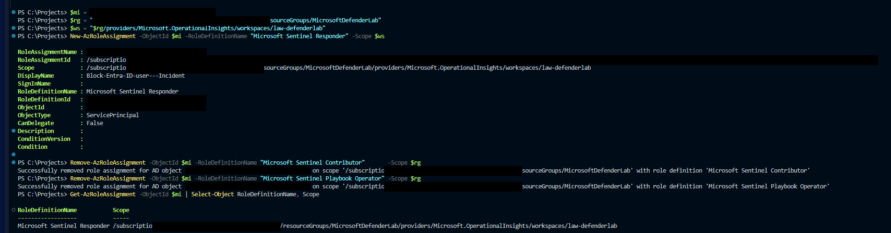

**Step 7: Delete unused API connections.** One of them held a saved Entra sign-in token.

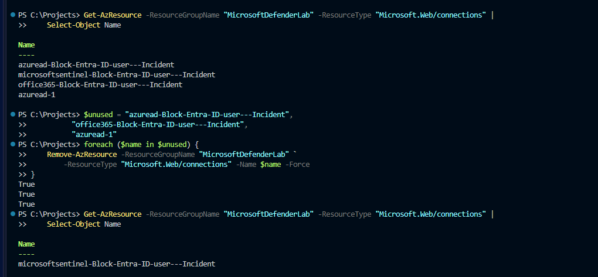

**Step 8: Remove leftover Global Admins.** Three test accounts still held Global Administrator from the first simulation. Down from five to two.

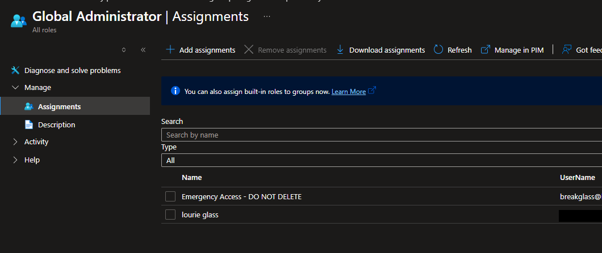

**Step 9: Test.** Assigned Security Administrator to `testattacker`. The rule fired, the playbook disabled the account, and it commented on the incident.

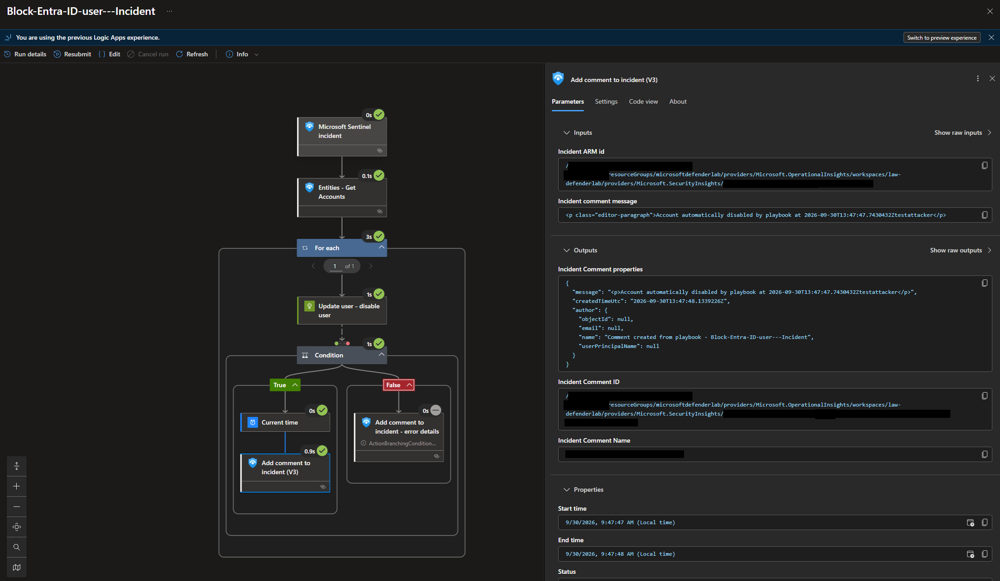

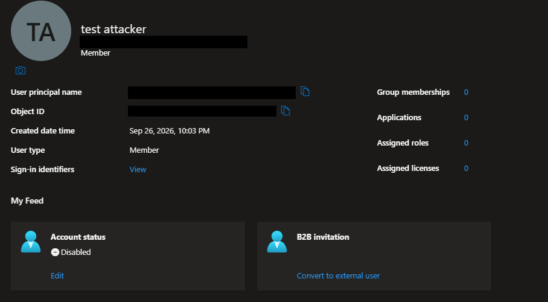

The test also surfaced a tuning issue: the rule's 30-minute lookback overlaps its 15-minute schedule, so the one role assignment produced two incidents.

**Step 10: Group duplicate alerts.** Enabled alert grouping by Account entity, so repeat alerts for the same account join one incident instead of creating new ones.

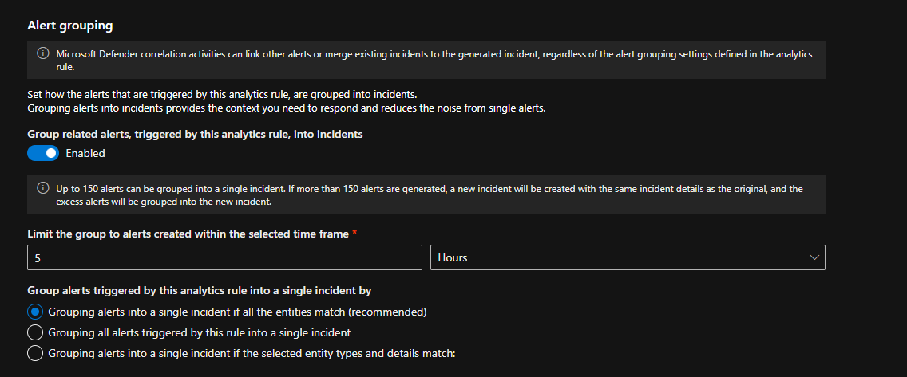

**Step 11: Protect break-glass.** Created an `AutomationExclusions` watchlist through the Sentinel REST API, and added a check at the top of the playbook's loop. Protected accounts get a "human review required" comment; the disable only runs for everyone else.

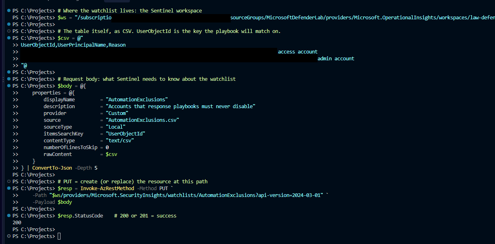

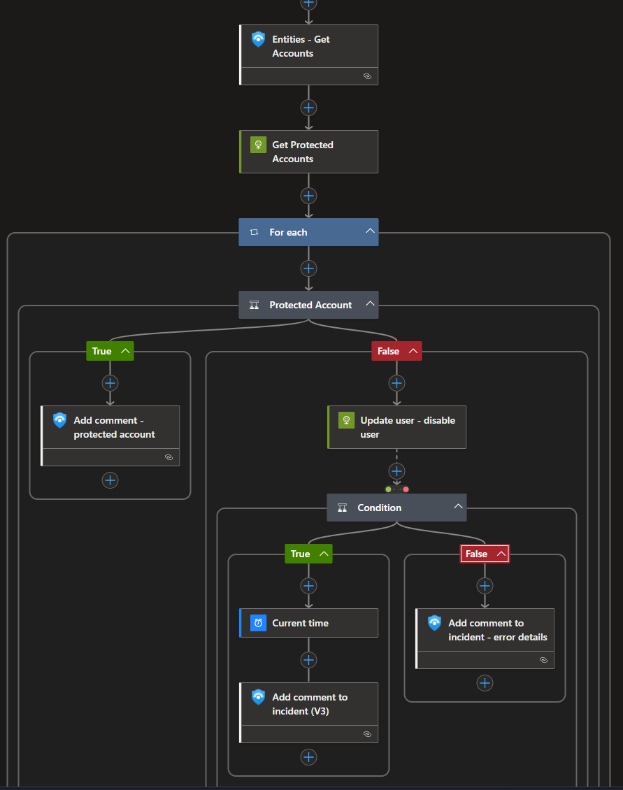

**Step 12: Test both.** Temporarily added `testuser1` to the watchlist and assigned it Security Administrator. Result: one incident with two alerts (grouping worked), one playbook run, a "protected account" comment, and `testuser1` stayed enabled. Then removed the test role and watchlist row.

Full writeup with commands and verification for each step: [Playbook audit and remediation](Simulated%20Priv%20Esc/playbook-audit-and-remediation.md)

## What this repo demonstrates

This project demonstrates that I can work across several connected disciplines:

- Azure resource setup and lab design
- Log Analytics and Microsoft Sentinel configuration
- Entra ID audit and identity activity investigation
- KQL analysis against real data
- custom detection engineering
- incident management and containment reasoning
- automation planning and playbook design
- technical documentation and evidence-backed storytelling

## At a glance

- Status: Active, working, and evolving into a stronger Azure security operations lab
- Core focus: Azure telemetry, identity security, KQL, detections, and response workflow
- Primary proof point: simulated T1098.003 investigation with screenshots, detections, and incident evidence
- Overall value: demonstrates end-to-end detection engineering capability in a realistic cloud environment

## Project flow

The Ward is built around a practical operational flow:

1. Azure and Entra ID telemetry is validated
2. logs are reviewed and investigated with KQL
3. suspicious activity becomes detection logic
4. incidents are created and triaged
5. response actions and automation are considered and documented

This is the operational model the project is designed to show.

## Supporting project work

The Ward also contains the broader Azure security lab groundwork, including:

- Azure Activity validation
- Log Analytics and Microsoft Sentinel enablement
- control-plane telemetry investigation
- security progress notes and milestone documentation
- concept testing around automation and response playbooks

## Repo map

- `README.md` - landing page and project summary
- `Azure-Security-Progress-Sept-21-2026.md` - milestone narrative and technical progress log
- `protecting_the_realm.md` - earlier security baseline notes
- `feature_showcase.md` - portfolio/slide framing
- `Simulated Priv Esc/` - the central investigation writeup and evidence set
- `screenshots/` - supporting visual records
- `SSH/` - lab tooling and access artifacts

## What I want to do next

The next steps are focused on making the lab more complete and repeatable:

- add more identity-based attack scenarios
- expand the analytics rule library beyond the first role-assignment detection
- add a watchlist exclusion so automation never touches the break-glass account
- continue documenting investigations in a clean, evidence-driven format
- turn the working lab into a more mature security operations workflow

## Final statement

The Ward is no longer just a configuration exercise. It is a working Azure security operations lab with a real privilege-escalation investigation at the center of the story. If someone opens the repo and wants to understand what I can do, this is the section I want them to see first.

