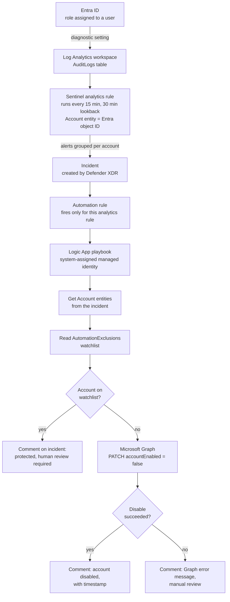
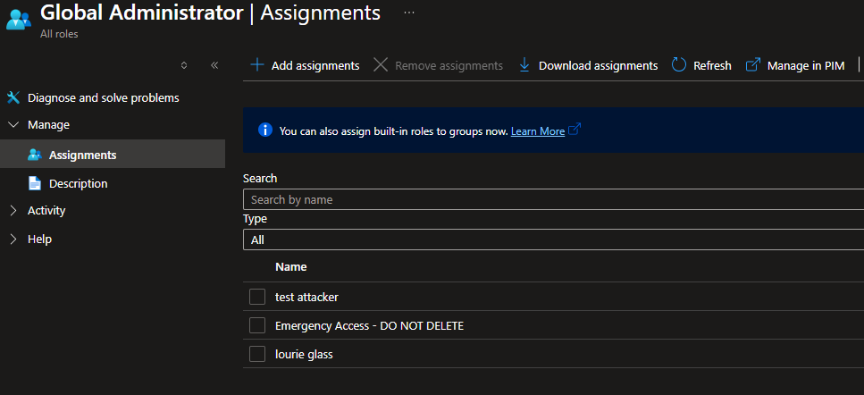
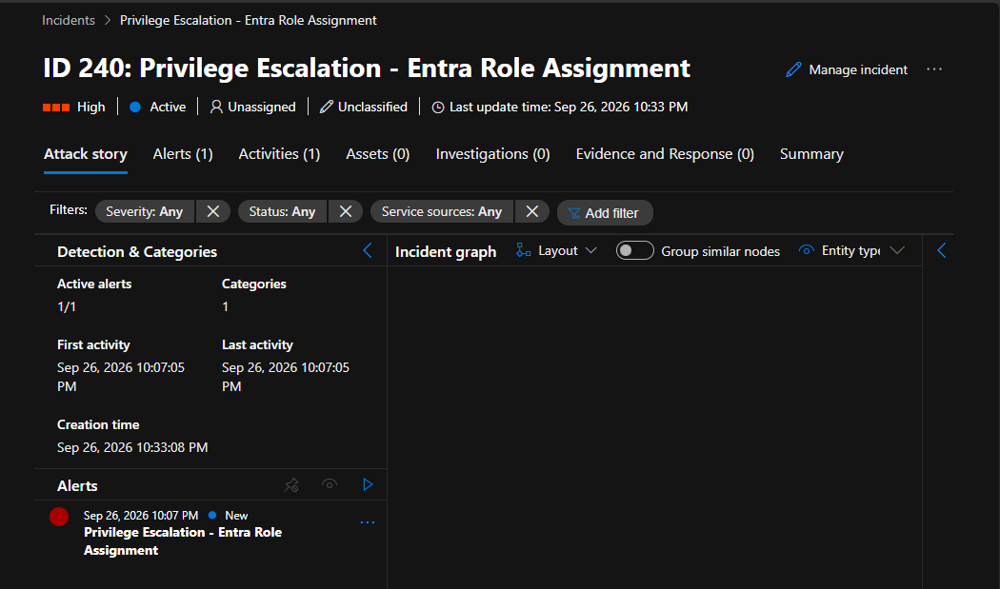
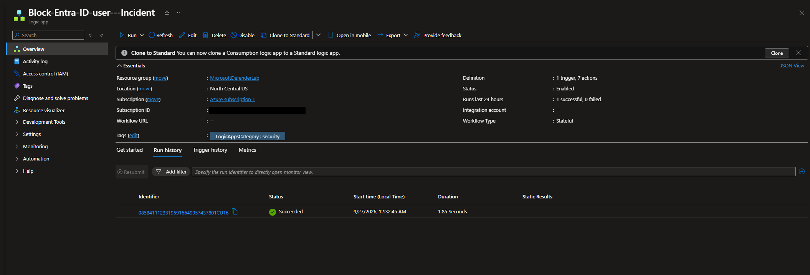
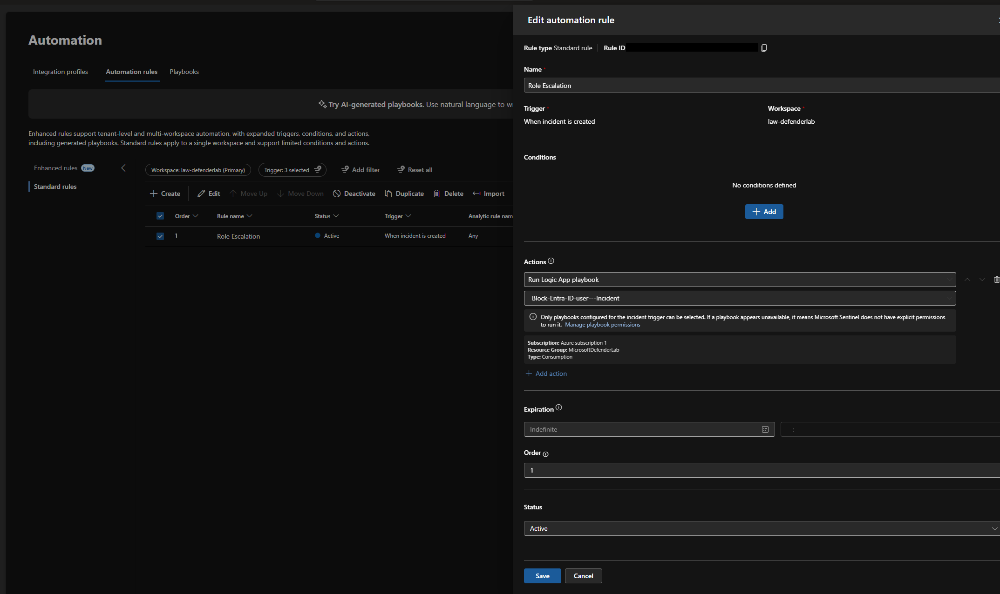

# The Ward: Azure Sentinel Detection and Automated Response

Detects privilege escalation in Microsoft Entra ID (MITRE ATT&CK [T1098.003](https://attack.mitre.org/techniques/T1098/003/)) with Microsoft Sentinel and automatically disables the targeted account, while keeping break-glass and admin accounts out of reach of the automation.

**The short version:** the first build of the response playbook reported *Succeeded* on every run and never disabled anyone. I audited the deployment, found five configuration bugs, fixed them, added duplicate-alert grouping and a break-glass exclusion, and proved each change with audit logs.

| Result | Evidence |
|---|---|
| Incident to disabled account: **~30 seconds** | Entra audit log `Disable account`, initiated by the playbook |
| Role assignment to incident: **~18 minutes** | 15-minute rule schedule plus audit log delay |
| Duplicate incidents per event: **2 → 1** | Alert grouping by Account entity |
| Protected accounts: **skipped, human review requested** | Tested with a temporary watchlist entry |
| Playbook permissions: **least privilege** | Graph `User.EnableDisableAccount.All` + `User.Read.All`; Sentinel Responder on the workspace only |

## Architecture

| Component | Resource | Access it holds |
|---|---|---|
| Workspace | `law-defenderlab` (North Central US) | Receives Entra `AuditLogs` via diagnostic setting |
| Detection | [T1098.003 KQL rule](privilege-escalation-case-study/T1098.003_privilege_escalation_detection.kql) | Watches five high-impact admin roles |
| Playbook identity | System-assigned managed identity | Graph: enable/disable users, read users. Azure: Sentinel Responder on the workspace |
| Exclusions | `AutomationExclusions` watchlist | Break-glass account and primary admin account |

## Part 1: Detection

A throwaway account was made Global Administrator minutes after it was created. The event was traced from the Entra audit trail through Log Analytics to a custom Sentinel rule and incident.

Full investigation: [T1098.003 investigation writeup](privilege-escalation-case-study/T1098.003_investigation_writeup.md)

## Part 2: Fixing the automated response

**Step 1: Audit.** The run history said Succeeded, but the playbook's identity had no Graph permissions, so it couldn't have disabled anyone.

**Step 2: Fix the entity mapping.** The rule put a UPN into the `AadUserId` slot, which expects the object ID the playbook uses to find the user. Before and after:

**Step 3: Fix the success comment.** It was being posted to a tenant ID instead of the incident. Fixed in the Logic App designer (the result shows in Step 9).

**Step 4: Scope the automation rule.** With no conditions, the block-user playbook would have run on every incident. Before and after:

**Step 5: Grant Graph permissions** to the managed identity with Microsoft Graph PowerShell. I chose not to give it an Entra admin role: anyone who can edit the Logic App inherits whatever its identity can do.

**Step 6: Narrow the Sentinel role** from Contributor and Playbook Operator on the resource group to Responder on the workspace only.

**Step 7: Delete unused API connections.** One of them held a saved Entra sign-in token.

**Step 8: Remove leftover Global Admins.** Three test accounts still held Global Administrator from the first simulation. Down from five to two.

**Step 9: Test.** Assigned Security Administrator to a test account. The rule fired, the playbook disabled the account, and it commented on the incident.

The test also exposed a tuning issue: the 30-minute lookback overlaps the 15-minute schedule, so one role assignment produced two incidents.

**Step 10: Group duplicate alerts** by Account entity, so repeat alerts for the same account join one incident.

**Step 11: Protect break-glass.** Created an `AutomationExclusions` watchlist through the Sentinel REST API and added a check ahead of the disable. Exclusions sit in the playbook, not the detection, so changes to the most sensitive accounts are still detected.

**Step 12: Test both.** A temporarily protected test account produced one incident with two alerts, one playbook run, a "protected account" comment, and stayed enabled.

Full writeup with commands, timestamps, and verification for every step: [Playbook audit and remediation](privilege-escalation-case-study/playbook-audit-and-remediation.md)

## Skills used

- **Microsoft Sentinel:** scheduled analytics rules, entity mapping, alert grouping, automation rules, watchlists
- **KQL:** detection query over `AuditLogs`, `SecurityAlert` analysis of query windows
- **Microsoft Entra ID:** directory roles, break-glass design, audit logs
- **Microsoft Graph:** app role assignment to a managed identity, user disable via `PATCH`
- **Azure RBAC:** scoping roles to a single resource, add-before-remove role changes
- **Logic Apps:** conditions, loops, managed identity HTTP actions, run history debugging
- **PowerShell:** Az and Microsoft Graph modules, `Invoke-AzRestMethod` where no cmdlet exists

## Repository layout

| Path | Contents |
|---|---|
| [`privilege-escalation-case-study/`](privilege-escalation-case-study/) | Detection writeup, remediation writeup, KQL rule, evidence screenshots |
| [`screenshots/`](screenshots/) | Screenshots for the remediation steps and journal |
| [`lab-journal/`](lab-journal/) | Dated progress notes from building the lab (Sept 17 and 21) |

## What's next

Rebuild this environment as Bicep so it can be torn down and redeployed from code, with the Graph permission grant as a PowerShell post-deployment step.

The initial audit and some of the troubleshooting in this project were done with Claude Code as a lab partner. The fixes were applied by me in the Azure portal and PowerShell, except where the writeup says otherwise.
