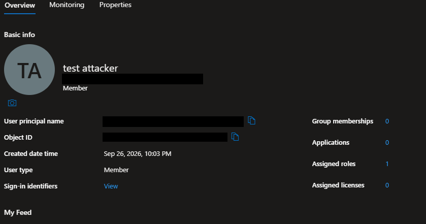
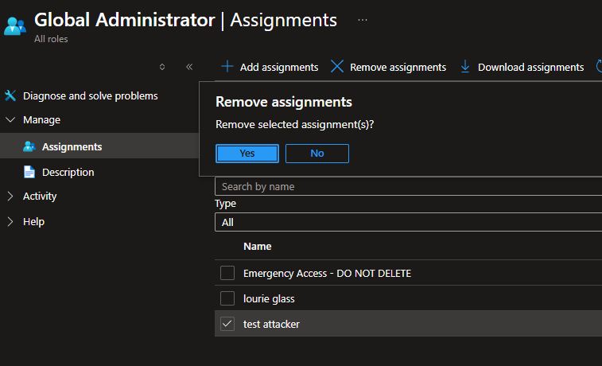
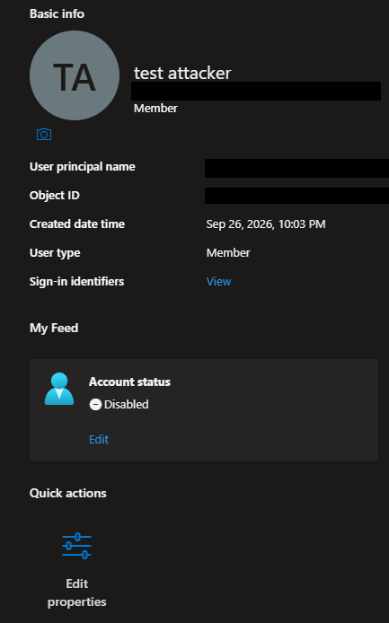
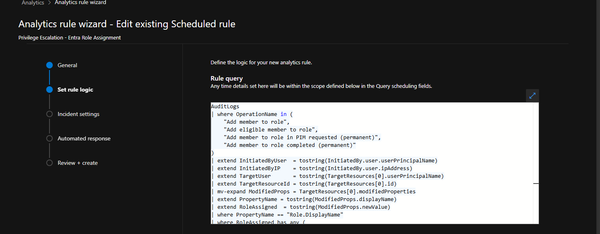
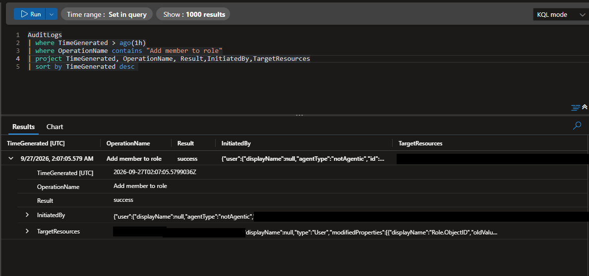
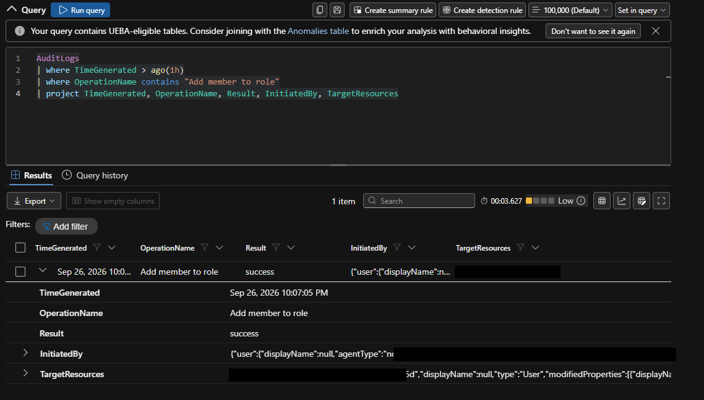
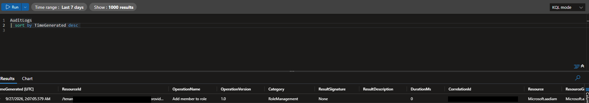
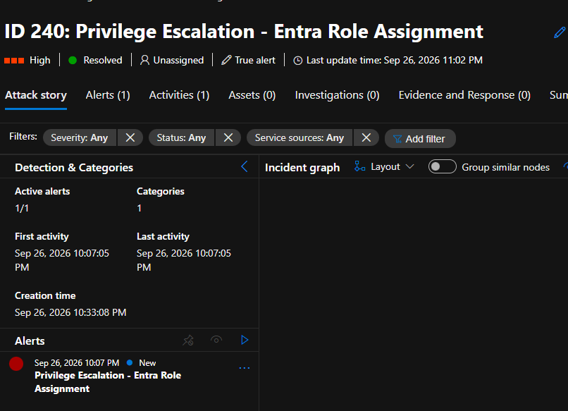
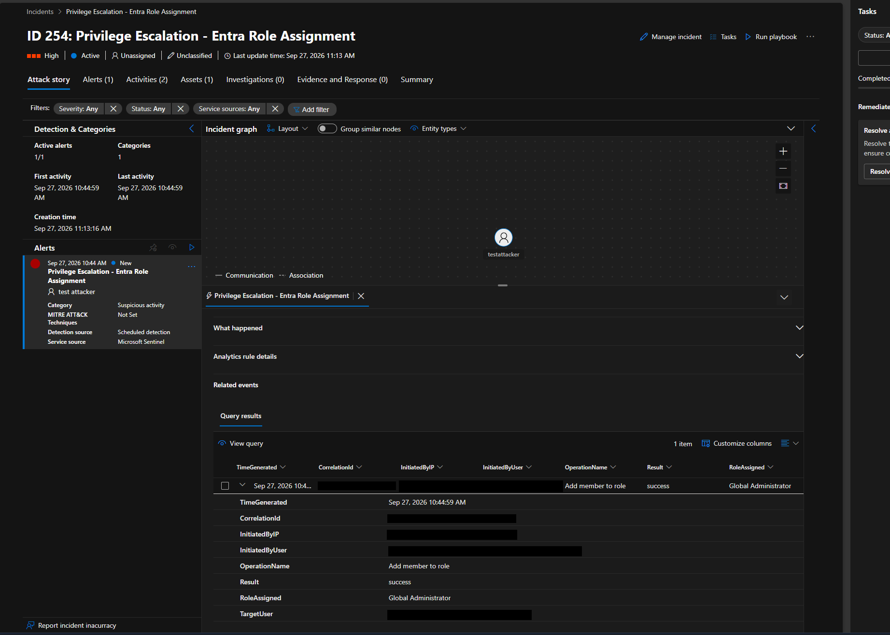
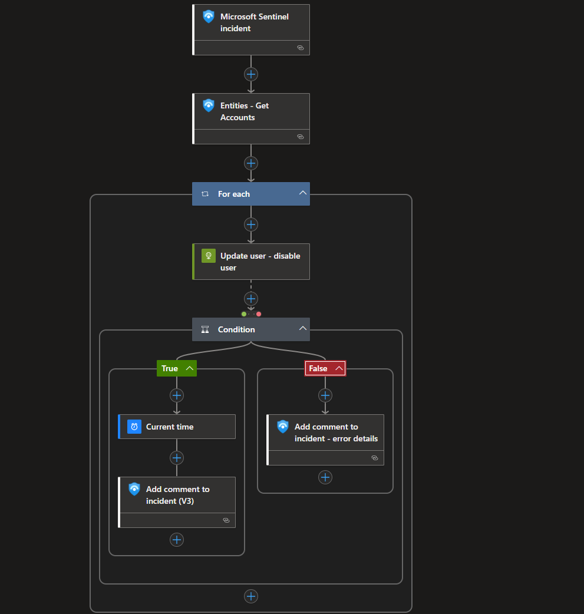

# Detection & Investigation: Privilege Escalation via Additional Cloud Role Assignment

**MITRE ATT&CK Technique:** T1098.003 - Account Manipulation: Additional Cloud Roles
**Tactics:** Persistence, Privilege Escalation
**Environment:** Skyhold (Azure Cloud Infrastructure Lab) - `MicrosoftDefenderLab` resource group
**Author:** Lourie Glass
**Date:** September 26-27, 2026

---

## 1. Objective

Simulate a real-world privilege escalation technique, in which an attacker with role-assignment
rights grants a low-value or newly created account a highly privileged Entra ID role, detect it
with a custom KQL analytics rule in Microsoft Sentinel, and document the investigation the way a
SOC analyst would triage a real incident: from raw log to root cause to response plan.

## 2. Why This Technique

Additional Cloud Roles (T1098.003) is one of the most common post-compromise moves in real
breaches: once an attacker has a foothold, granting a second account (often one they just
created) a role like Global Administrator guarantees they keep control of the tenant even if the
original compromised identity is found and disabled. It maps directly to the identity and
governance work already built in Skyhold: Entra ID, RBAC, and tenant user provisioning.

## 3. Lab Setup

- **Log Analytics workspace:** `law-defenderlab` (resource group `MicrosoftDefenderLab`)
- **Connected to Microsoft Sentinel:** Yes
- **Data connector:** Microsoft Entra ID (Azure AD) Audit Logs, via the diagnostic setting
  `AzureSentinel_law-defenderlab`, routing the `AuditLogs` category from `/providers/microsoft.aadiam`
  into the workspace above
- **Tenant:** `contoso.onmicrosoft.com` (tenant ID `11111111-1111-1111-1111-111111111111`)
- **Test account:** `testattacker@contoso.onmicrosoft.com` (Object ID
  `aaaaaaaa-aaaa-aaaa-aaaa-aaaaaaaaaaaa`), a throwaway lab account created specifically for this
  exercise, with zero group memberships, applications, or licenses at creation

## 4. Detection Logic

Two versions of this detection exist in this repo, deliberately, as two stages of the same
build-and-tune process:

**v1 - broad validation rule (deployed first, and the version that fired on September 27):**

```kql
AuditLogs
| where OperationName contains "Add member to role"
| project TimeGenerated, OperationName, Result, InitiatedBy, TargetResources
| sort by TimeGenerated desc
```

Deployed as a Sentinel Scheduled Analytics Rule:

| Setting | Value |
|---|---|
| Name | Privilege Escalation - Entra Role Assignment |
| Severity | High |
| Rule frequency | Every 15 minutes |
| Lookback period | Last 30 minutes |
| Threshold | Alert if query returns more than 0 results |
| Event grouping | Alert per event |
| Incident creation | Enabled |

This version is intentionally broad. Its job was to prove the pipeline end to end (diagnostic
setting to Log Analytics to Sentinel to a firing rule) before adding filtering logic on top of it.

**v2 - tuned, high-fidelity query** (`T1098.003_privilege_escalation_detection.kql` in this repo):
narrows the same event stream down to a short list of high-privilege roles (Global Administrator,
Privileged Role Administrator, Security Administrator, Application Administrator, Cloud
Application Administrator) so a real SOC wouldn't be flooded with every routine role change. This
is the version intended for production use; see that file for the full query and tuning notes.
As of September 30, v2 is the query running in the deployed rule, with `TargetResourceId`
added to its output for entity mapping.

**Why build it this way:** a working v1 that's too noisy to run continuously is a normal, honest
first step in detection engineering. Shipping the narrower v2 as the "final" query without ever
validating the broad version first would have hidden that process. Documenting both is more
representative of how this work actually gets done.

## 5. Simulation Steps

1. Created a test account in the lab tenant: `testattacker@contoso.onmicrosoft.com`,
   September 26, 2026, 10:03 PM.
2. As a simulated attacker action, assigned that account the **Global Administrator** role via
   the **Azure Portal** (Entra ID > Roles and administrators > Global Administrator > Add
   assignments) at 2026-09-27T02:07:05Z UTC (September 26, 10:07 PM local).
3. Confirmed the event in Entra ID's own audit trail: operation `Add member to role`, category
   `RoleManagement`, result `success`, correlation ID `dddddddd-dddd-dddd-dddd-dddddddddddd`.
4. Queried the `law-defenderlab` Log Analytics workspace directly and confirmed the same event had
   already landed in the `AuditLogs` table under the identical timestamp and correlation ID,
   ingestion lag was under a minute.
5. Ran the detection query in Sentinel > Logs and confirmed it returned the simulated event,
   correctly identifying the initiating account, the target account (`test attacker`), and the
   modified `Role.ObjectID` property.
6. Saved the query as a Sentinel Scheduled Analytics Rule, "Privilege Escalation - Entra Role
   Assignment," High severity, running every 15 minutes over a 30-minute lookback window, with
   incident creation enabled. Validation passed on save.
7. Confirmed the rule's scheduled run fired and produced a Sentinel Incident. This was validated
   twice over: the original build produced **Incident 240** (Defender XDR ID; Sentinel incident #16), and later, while building and testing
   the automated response playbook (Section 8), the same rule correctly fired again on a fresh
   simulated escalation, producing **Incident 254** (Defender XDR ID; Sentinel incident #30) with the `testattacker` account properly
   resolved into the incident's entity graph, confirming the detection-to-incident pipeline is
   reliable, not a one-off.

## 6. Evidence

The screenshots below are stored in the Simulated Priv Esc folder and are embedded directly in this writeup.

### Role assignment and account evidence


*Global Administrator role assignments showing `test attacker` alongside the tenant break-glass account and the admin account.*


*The test account overview confirming the account properties and Object ID used in the Entra audit trail.*


*Removal of the Global Administrator assignment during incident closure.*


*The account Overview blade confirming the account status is Disabled after containment.*

### Detection and Sentinel evidence


*The Analytics Rule wizard showing the deployed configuration and successful validation.*


*The tuned role-filtered detection query used for the incident trigger.*


*The query returning the simulated event in Sentinel > Logs with expanded identity fields.*


*Raw AuditLogs data confirming ingestion into the law-defenderlab workspace.*


*The generated Sentinel incident for the simulated privilege escalation.*


*Incident 240 (Sentinel #16) closed out as a resolved true alert.*


*The incident graph correctly resolving the `testattacker` identity as an entity.*

### Automation and response evidence


*The Sentinel Standard automation rule wiring the alert to the response playbook.*


*The Logic App Designer canvas for the response workflow.*


*The successful response branch in the Logic App showing the user-disable action path.*

## 7. Analysis / Findings

- **What happened:** `testattacker@contoso.onmicrosoft.com` was granted the **Global
  Administrator** role at `2026-09-27T02:07:05Z`, operation `Add member to role`, result
  `success`.
- **Is this expected?** No, by design. This was a simulated unauthorized escalation: the target
  account was four minutes old at the time of the grant, had no group memberships, no licenses,
  and no prior sign-in activity, then was immediately assigned the tenant's highest privilege
  role, with no PIM eligible-activation step, a straight permanent assignment. In a real
  environment, a brand-new or dormant account jumping straight to Global Administrator with no
  associated change ticket is a strong indicator of compromise rather than routine admin work.
- **Risk assessment:** Global Administrator grants full control of the tenant: resetting any
  user's credentials (including other admins), modifying Conditional Access policies, granting
  further privileged roles, and managing every Azure resource under the directory. An attacker
  holding this role can re-establish access even after the original compromised account is found
  and remediated, which is exactly what makes T1098.003 a persistence technique, not just a
  one-time privilege grab.
- **Indicators that increased suspicion here:** near-zero time between account creation and
  privilege grant; target account never provisioned with normal access (no groups, no licenses);
  permanent assignment rather than a time-bound PIM activation. The tenant's actual break-glass
  account (`Emergency Access - DO NOT DELETE`) was correctly untouched and sat in the same
  assignments list as a useful point of comparison.

## 8. Automated Response — SOAR Playbook (Logic App)

Detection alone isn't a complete detection-engineering story, so this build also includes an
automated response layer: a Microsoft Sentinel Playbook (Azure Logic App) wired to fire whenever
this rule creates an incident, built from Microsoft's official **Block-AADUser** template and
extended with incident commenting.

**Playbook architecture** (`Block-Entra-ID-user---Incident`):

1. **Trigger:** Microsoft Sentinel incident (fires on incident creation via a Sentinel Automation
   Rule)
2. **Entities - Get Accounts:** pulls the Account entity/entities mapped to the triggering
   incident
3. **For each** account entity:
   - **Update user - disable user:** an HTTP action authenticating via the Logic App's
     system-assigned Managed Identity, calling `PATCH https://graph.microsoft.com/v1.0/users/{id}`
     with `{"accountEnabled": false}`
   - **Condition:** checks whether the disable call succeeded
     - **True:** adds a success comment to the incident
     - **False:** adds an error-detail comment to the incident instead of failing silently

**Automation wiring:** a Sentinel **Standard** automation rule ("Role Escalation"), trigger
**When incident is created**, action **Run Logic App playbook** targeting this workflow, confirmed
firing automatically the moment this rule creates a new incident, no manual trigger required.

**What's confirmed working end to end:** the full orchestration path, trigger, entity retrieval,
the loop, and the conditional error-handling branch, runs successfully and correctly identifies
the target account from a live incident. Incident 254 (Sentinel #30), generated after the entity mapping was
corrected, shows the `testattacker` account resolved directly into the incident's entity graph,
confirming Sentinel hands the Logic App real, actionable data rather than an empty payload.

> **Update, September 30, 2026:** resolved. An audit found five configuration bugs, including
> missing Graph permissions and an entity mapping that put a UPN in the `AadUserId` slot. After
> fixing them, the playbook disabled a test account automatically about 30 seconds after the
> incident was created. See [playbook-audit-and-remediation.md](playbook-audit-and-remediation.md).
> The original notes below are left as written.

**Known limitation, documented honestly rather than glossed over:** the `Update user - disable
user` HTTP action itself did not reliably succeed during testing. Debugging traced this to a chain
of subtle issues rather than one root cause:

- The Sentinel entity-mapping identifier **FullName**, while a valid *configuration-time* option
  in the analytics rule, doesn't correspond to an actual property name on the entity object the
  Logic App connector returns at runtime. The connector's real Account schema uses
  lowercase/camelCase keys instead (`accountName`, `upnSuffix`, `aadUserId`, `displayName`,
  `additionalData.UserPrincipalName`), confirmed by inspecting the raw JSON output of the
  `Entities - Get Accounts` action directly rather than trusting the portal's friendly labels.
- Logic Apps expression lookups (`item()?['key']`) are case-sensitive, so `AadUserId`, as offered
  by the dynamic-content picker itself, silently returned nothing where the real key was
  `aadUserId`.
- Editing the same expression repeatedly between the Designer's field view and its Code view
  introduced stray characters (an extra `"`, a duplicated `"uri":` prefix) that corrupted the URI
  without an obvious visual cue, a reminder that structured-data editors layered under form fields
  aren't always as WYSIWYG as they look.
- Separately, some test incidents legitimately had **zero entities** attached, because Sentinel
  bakes entity mapping into an incident at creation time, so an incident created before an
  entity-mapping fix carries no entities even after the rule is corrected. Only a freshly
  generated incident reflects a mapping fix.

Given the compounding editor issues, the disable action is documented here as an open item rather
than a false "it works" claim. In this lab, the account was disabled manually via Entra ID as part
of incident closure (Section 9); the SOAR playbook's orchestration, entity handling, and
error-branch commenting are fully built and verified, and the remaining fix (a clean,
`aadUserId`-based URI, confirmed correct in isolation) is a known, scoped next step rather than an
unknown.

## 9. Incident Closure — Response Actions Taken

With the account confirmed as an unauthorized Global Administrator escalation:

1. **Removed the Global Administrator role assignment** from `testattacker` via Entra ID > Roles
   and administrators > Global Administrator > Remove assignments.
2. **Disabled the account** (`testattacker@contoso.onmicrosoft.com`) via Entra ID >
   Users, confirmed via the account's Overview blade showing Account status: **Disabled**.
3. **Closed Incident 240** (Sentinel #16) in Sentinel, classified as **True alert**, status set to **Resolved**.

These are the same actions the SOAR playbook's disable step is designed to automate; performing
them manually here confirms the correct response and gives a clean before/after: the Global
Administrator assignments list showing `test attacker` alongside the tenant's break-glass account
before removal, and the account's Disabled status after.

For a real production deployment, the remaining steps to fully automate this would be: finish
verifying the corrected `aadUserId`-based URI end to end, and separately grant the Logic App's
managed identity the Microsoft Graph `User.ReadWrite.All` application permission (there's no
Azure Portal UI for this; it requires the Microsoft Graph PowerShell SDK), since a system-assigned
managed identity has zero Graph permissions by default.

A full incident-response playbook would additionally:

- Pull `SigninLogs` for both accounts around the event window to check for unfamiliar locations,
  IPs, or unusual sign-in patterns.
- Check for follow-on persistence: new app registrations or service principals, new OAuth consent
  grants, Conditional Access changes, or additional role assignments made by either account after
  the initial grant.
- Document the full timeline, account creation, role grant, detection, containment, and escalate
  per the rule's configured severity (High).

## 10. Lessons Learned

Building this end to end surfaced a few things a KQL snippet alone wouldn't: the Entra ID
`InitiatedBy`/`TargetResources` fields frequently leave `displayName` null even for real,
named accounts, so a detection has to rely on `userPrincipalName` and object IDs, not display
names, to reliably identify who did what. I also hit a genuine Azure guardrail while wiring this
up: Entra ID's diagnostic settings won't let the same log category route to the same workspace
under two different setting names, which turned out to mean the pipeline was already correctly
configured rather than broken. Deploying a deliberately broad rule first, before the role-filtered
version, made it obvious how much alert noise a real SOC has to design against from day one,
tightening the query afterward was a design decision, not an afterthought.

Building the automated response layer surfaced a deeper lesson than the detection side did:
portal-level configuration options, like an entity-mapping identifier, don't always correspond
one-to-one to the property names a downstream connector actually returns at runtime. The only
reliable way to know is to inspect the raw JSON a step actually produced, not the friendly labels
a wizard shows. It also reinforced that structured-data editors, a JSON code view layered under
form fields, can silently corrupt a value in ways that are easy to miss visually; when something
isn't behaving as expected, a clean full-block replace beats an incremental field edit.

---

**Files in this folder:**
- `T1098.003_privilege_escalation_detection.kql` - the tuned, role-filtered detection query (v2),
  exported from the deployed analytics rule
- `*.png` - evidence captured during this simulation, including the analytics rule, the
  Sentinel automation rule, the response playbook's Designer canvas, and incident closure
- `playbook-audit-and-remediation.md` - the September 30 follow-up that got the automated
  disable working
- This write-up
