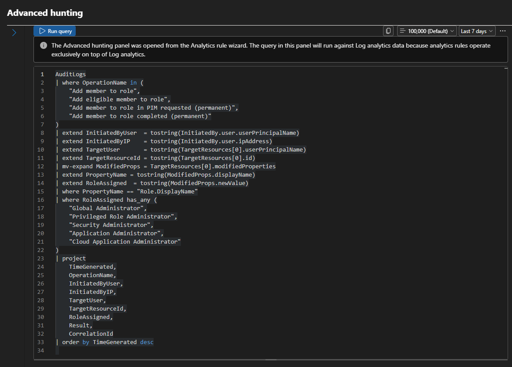

# Playbook Audit and Remediation: Making the Block-User Response Actually Work

**Follows:** [T1098.003 investigation writeup](T1098.003_investigation_writeup.md), Section 8 ("Known limitation")
**Environment:** `MicrosoftDefenderLab` resource group, North Central US, workspace `law-defenderlab`
**Author:** Lourie Glass
**Dates:** September 29-30, 2026

---

## Where this started

The original T1098.003 writeup ended with an open item: the Sentinel playbook `Block-Entra-ID-user---Incident` ran and reported success, but it never disabled anyone. I disabled `testattacker` by hand during incident closure and documented the automation as unfinished.

I was tempted to delete the resource group and rebuild. Instead I audited what was deployed first. The audit was run with Claude Code as a lab partner, reading configuration through Azure CLI and the Microsoft Graph and ARM REST APIs. I made the fixes myself in the portal and in PowerShell.

The steps below are in the order I did them.

| Step | What | Where |
|---|---|---|
| 1 | Audit the deployment | Azure CLI, Graph/ARM APIs |
| 2 | Fix the entity mapping | Sentinel analytics rule |
| 3 | Fix the success comment | Logic App designer |
| 4 | Scope the automation rule | Sentinel automation |
| 5 | Grant Graph permissions to the managed identity | Microsoft Graph PowerShell |
| 6 | Narrow the identity's Sentinel role | Az PowerShell |
| 7 | Delete unused API connections | Az PowerShell |
| 8 | Remove leftover Global Admins | Microsoft Graph PowerShell |
| 9 | Test end to end | Entra ID, Sentinel, Logic App run history |

---

## Step 1: Audit the deployment

The playbook design itself was fine. Trigger on incident, get the Account entities, and for each account PATCH the user through Graph, then comment on the incident with the result:


*The playbook as deployed. The logic didn't change during this work; its configuration and permissions did.*

The run history was misleading. This 9/27 run shows Succeeded:


*At the time of this run the managed identity had no Graph permissions, so it could not have disabled anyone.*

"Succeeded" means no action ended in an unhandled failure. When `Entities - Get Accounts` returns nothing, the loop runs zero times and the run still succeeds. The latest pre-fix run (9/28) showed exactly that: every action inside the loop was `Skipped`. Two runs that did reach the disable step failed.

What the audit found in the resource group:

| Resource | State found | Decision |
|---|---|---|
| `law-defenderlab` + Sentinel + UEBA | Healthy, Entra logs arriving | Keep |
| Analytics rule "Privilege Escalation - Entra Role Assignment" | Query good, entity mapping wrong | Fix (Step 2) |
| Playbook `Block-Entra-ID-user---Incident` | Comment action misconfigured, no Graph permissions, over-broad Sentinel role | Fix (Steps 3, 5, 6) |
| Automation rule "Role Escalation" | No conditions | Fix (Step 4) |
| `microsoftsentinel-...` API connection | Ready, used by the playbook | Keep |
| `azuread-...`, `office365-...`, `azuread-1` API connections | Unused | Delete (Step 7) |

Outside the resource group:

- A second Sentinel workspace in a separate East US resource group (`Microsoft-Sentinel-Resource-Group`). I deleted it before starting the fixes.
- Five Global Administrators, three of them test accounts left over from the 9/27 simulation (Step 8).
- Entra diagnostic settings still exporting to two workspaces that no longer exist (`evidence-law`, `law-the-ward`).
- `SignInLogs` not included in the export to `law-defenderlab`.

Ingestion over 30 days was about 0.17 GB, mostly `MicrosoftGraphActivityLogs`, so cost was not a factor.

---

## Step 2: Fix the entity mapping

The analytics rule mapped the `TargetUser` column (a UPN like `testattacker@...onmicrosoft.com`) to the Account identifier `AadUserId`. That identifier expects the Entra object ID, a GUID.


*Before: `AadUserId` mapped to `TargetUser`, a UPN.*

The playbook builds its Graph call from that value:

```
PATCH https://graph.microsoft.com/v1.0/users/@{item()?['aadUserId']}
```

The query already computed the GUID as `TargetResourceId` but dropped it in the final `project`. First I added it back to the query:


*`TargetResourceId` added to the `project` list (line 29).*

Then I remapped the entity:


*After: `AadUserId` mapped to `TargetResourceId`.*

The mapping dropdown didn't list the new column until the query change was saved. Saving once with the old mapping, then reopening the rule, fixed it.

Why the GUID and not the UPN: the object ID never changes, while a UPN can change on a rename or domain move. Automation that disables accounts should key on the value that can't drift.

**Verified:** rule config read back through the Sentinel API showed `AadUserId <- TargetResourceId`, last modified 2026-09-29 19:45 UTC.

---

## Step 3: Fix the success comment

Inside the loop, `item()` is the current account. The success branch's comment action had:

```
"incidentArmId": "@item()?['AadTenantId']"
```

That's the account's tenant ID, not an incident, so the comment had nowhere to go and the action failed. The error branch was already correct, so in the Logic App designer I set the success branch's **Incident ARM id** to the trigger's **Incident ARM ID** dynamic value:

```
"incidentArmId": "@triggerBody()?['object']?['id']"
```

This is the **Add comment to incident (V3)** action in the True branch of the canvas shown in Step 1. I also replaced the literal words "current time" in the message with the output of the `Current time` action.

**Verified:** workflow definition read back after save (changed 2026-09-29 20:02 UTC). The fix in action is shown in Step 9: the Incident ARM id now resolves to a real `.../SecurityInsights/Incidents/...` path.

---

## Step 4: Scope the automation rule


*Before: "No conditions defined." The rule list shows Analytic rule name = Any.*

With no conditions, the block-user playbook would run on every incident in the workspace, including Fusion detections and Defender sample alerts. Once the playbook could actually disable accounts, any incident naming an account could disable it.

I clicked **+ Add** under Conditions and set **Analytic rule name** contains **Privilege Escalation - Entra Role Assignment**.


*After: one condition limits the rule to the privilege escalation detection.*

The portal shows the rule by name, but the API shows the condition is stored by rule ID:

```
IncidentRelatedAnalyticRuleIds  Contains  .../alertRules/eeeeeeee-eeee-eeee-eeee-eeeeeeeeeeee
```

Renaming the analytics rule later won't break the automation rule.

**Verified:** automation rule read back through the Sentinel API, modified 2026-09-29 20:08 UTC.

---

## Step 5: Grant Graph permissions to the managed identity

The disable step authenticates as the Logic App's system-assigned managed identity. Graph returned an empty list for that identity's app role assignments. Per the [Graph user update docs](https://learn.microsoft.com/graph/api/user-update?view=graph-rest-1.0#request-body), the least-privileged combination for changing `accountEnabled` is `User.EnableDisableAccount.All` + `User.Read.All`.

There's no portal button for granting Graph application permissions to a managed identity, so I did it in Microsoft Graph PowerShell:

```powershell
Connect-MgGraph -TenantId "<tenant-id>" -Scopes "Application.Read.All","AppRoleAssignment.ReadWrite.All"

$miId  = "cccccccc-cccc-cccc-cccc-cccccccccccc"   # playbook managed identity
$graph = Get-MgServicePrincipal -Filter "appId eq '00000003-0000-0000-c000-000000000000'"

$roles = $graph.AppRoles | Where-Object {
    $_.Value -in "User.EnableDisableAccount.All","User.Read.All" -and
    $_.AllowedMemberTypes -contains "Application"
}

foreach ($r in $roles) {
    New-MgServicePrincipalAppRoleAssignment -ServicePrincipalId $miId `
        -PrincipalId $miId -ResourceId $graph.Id -AppRoleId $r.Id
}
```


*The identity confirmed as `Block-Entra-ID-user---Incident` (type ManagedIdentity), the two app roles looked up by name, and both assignments created.*

I ran the loop twice by accident. The second run failed with `Permission being assigned already exists on the object`. Nothing changed, but it showed me this command isn't idempotent, and a reusable script needs to check for an existing assignment first.

**Design decision:** the Graph docs also say that in app-only scenarios, disabling some admin accounts requires the app to hold a higher-privileged Entra role (for example Privileged Authentication Administrator). I chose not to grant that. Anyone who can edit this Logic App can make its identity do whatever the identity is allowed to do, so giving it a top-tier Entra role would turn "Logic App Contributor" into a tenant takeover path. Automation handles what the Graph permissions allow; anything beyond that falls to the error branch and a human.

**Verified:** Graph showed both app role assignments on the identity, created 2026-09-30 12:36 UTC.

---

## Step 6: Narrow the identity's Sentinel role

The identity held **Microsoft Sentinel Contributor** and **Microsoft Sentinel Playbook Operator** on the whole resource group. The playbook only reads the incident and adds comments, which **Microsoft Sentinel Responder** covers. Playbook Operator is for whoever triggers playbooks, and Sentinel's own service identity already has that.

I added Responder at the workspace scope first, then removed the two broader roles, so the playbook never had a gap in access:

```powershell
New-AzRoleAssignment    -ObjectId $mi -RoleDefinitionName "Microsoft Sentinel Responder"         -Scope $ws
Remove-AzRoleAssignment -ObjectId $mi -RoleDefinitionName "Microsoft Sentinel Contributor"       -Scope $rg
Remove-AzRoleAssignment -ObjectId $mi -RoleDefinitionName "Microsoft Sentinel Playbook Operator" -Scope $rg
```


*Responder created on the workspace, both broad roles removed from the resource group, and `Get-AzRoleAssignment` returning only Responder.*

Steps 5 and 6 touch two different permission systems. Graph app roles control what the identity can do in Entra ID. Azure RBAC controls what it can do to Azure resources. Holding one grants nothing in the other.

**Verified:** `Get-AzRoleAssignment` and a separate `az role assignment list` both return one assignment: Responder on `law-defenderlab`.

---

## Step 7: Delete unused API connections

A Logic App lists every connection it uses in its `$connections` parameter. This playbook listed only `microsoftsentinel`, and it was the only Logic App in the subscription, so the other three connections were unused.

`azuread-1` mattered most. Its status was Connected, meaning it stored a delegated sign-in token that anyone able to edit a Logic App in the subscription could have used.

```powershell
$unused = "azuread-Block-Entra-ID-user---Incident",
          "office365-Block-Entra-ID-user---Incident",
          "azuread-1"

foreach ($name in $unused) {
    Remove-AzResource -ResourceGroupName "MicrosoftDefenderLab" `
        -ResourceType "Microsoft.Web/connections" -Name $name -Force
}
```


*Four connections listed before, three deleted (`True` for each), one left.*

**Verified:** the resource group now holds five resources: workspace, Sentinel, UEBA, playbook, and its Sentinel connection. The connection still reports Ready and the playbook is Enabled.

---

## Step 8: Remove leftover Global Admins

`testattacker`, `aldous.huxley`, and `testuser1` still held Global Administrator three days after the original simulation. I removed them with Graph PowerShell, checking that each assignment exists before removing it so the script is safe to rerun:

```powershell
$globalAdmin = "62e90394-69f5-4237-9190-012177145e10"   # role template ID, same in every tenant
$testUsers   = "testattacker@contoso.onmicrosoft.com",
               "aldous.huxley@contoso.onmicrosoft.com",
               "testuser1@contoso.onmicrosoft.com"

foreach ($upn in $testUsers) {
    $user = Get-MgUser -UserId $upn
    $assignment = Get-MgRoleManagementDirectoryRoleAssignment `
        -Filter "principalId eq '$($user.Id)' and roleDefinitionId eq '$globalAdmin'"
    if ($assignment) {
        Remove-MgRoleManagementDirectoryRoleAssignment -UnifiedRoleAssignmentId $assignment.Id
    }
}
```


*After: only the emergency-access account and my account hold Global Administrator.*

**Verified:** AuditLogs show three `Remove member from role` events at 13:11:43 UTC. Global Admins went from five to two.

---

## Step 9: Test end to end

At 13:14 UTC I assigned **Security Administrator** to `testattacker`, a role on the detection's watch list. Everything below comes from AuditLogs, the Sentinel incidents API, and the Logic App run history.

| Time (UTC) | Event |
|---|---|
| 13:14:01 | `Add member to role`: Security Administrator to `testattacker` |
| 13:32:13 | Incident #37 created (Defender XDR ID 261), Account entity `aadUserId = aaaaaaaa-aaaa-aaaa-aaaa-aaaaaaaaaaaa` |
| 13:32:42 | Automation rule starts the playbook |
| 13:32:43 | `PATCH /v1.0/users/aaaaaaaa-...` returns HTTP 204; AuditLogs record `Disable account` initiated by `Block-Entra-ID-user---Incident` |
| 13:32:44 | Success comment added to incident #37 |
| 13:38:27 | I removed the Security Administrator assignment from `testattacker` |
| 13:47:00 | Incident #38 (Defender XDR ID 262) created for the **same** 13:14 event |
| 13:47:47 | Playbook runs again and comments on incident #38 |


*`testattacker` after the test: Account status Disabled. Assigned roles shows 0 because I removed the Security Administrator assignment afterwards.*

Detection to containment took about 18 minutes, almost all of it the rule's 15-minute schedule plus audit log delay. From incident creation to a disabled account took 30 seconds.

The run for incident #38, showing every step green and the comment posted to the incident:


*Run at 13:47 UTC (9:47 local). Loop ran once for one account; the True branch posted the comment. The Incident ARM id input is a full incident path, which is the Step 3 fix working.*

### Finding: one event, two incidents

Incidents #37 and #38 came from the same audit event. The two alerts in `SecurityAlert` share the event time 13:14:01 but have different query windows:

| Alert | Query window (UTC) |
|---|---|
| Incident #37 | 12:55:58 - 13:25:59 |
| Incident #38 | 13:10:58 - 13:40:59 |

The rule runs every 15 minutes but looks back 30, so every event lands in two consecutive windows. The 30-minute lookback is there on purpose, to catch audit logs that arrive late, so shrinking it isn't the right fix. Alert grouping on the Account entity would merge the second alert into the first incident, and since the automation rule only triggers on incident *creation*, the playbook would run once. This is listed under Still open.

Each fix showed up in this run:

| Step | Evidence from the run |
|---|---|
| 2: Entity mapping | Incident entity carried the GUID, and the Graph URI used it |
| 3: Comment target | Comment posted on incident #37 |
| 4: Automation rule condition | Playbook ran for this rule's incident |
| 5: Graph permissions | HTTP 204 and a `Disable account` audit event |
| 6: Responder role | Sufficient to post that comment |

### A prediction that was wrong

Before the test I expected Graph to refuse the disable, since the target had just been made an admin. It didn't. A Security Administrator was disabled with only `User.EnableDisableAccount.All` + `User.Read.All`. Graph's extra protection for sensitive actions depends on which role the target holds, and Security Administrator wasn't enough to trigger it.

**Not verified:** whether a Global Administrator target would be blocked. I expect it would, based on the docs, but haven't tested it.

---

## Still open

- Enable alert grouping on the analytics rule (by Account entity) so one role assignment produces one incident, not two.
- Remove the stale Entra diagnostic settings pointing at `evidence-law` and `law-the-ward`.
- Add `SignInLogs` to the `law-defenderlab` export.
- The success comment rendered as `...at 2026-09-30T13:32:44.0343912Ztestattacker`: the account name token sits right after the timestamp. Move it next to "Account."
- Add `FullName <- TargetUser` as a second Account identifier so incidents show a readable name.
- Test against a Global Administrator target.
- Add a Sentinel watchlist of accounts the playbook must never touch (starting with `breakglass`) and check it in the automation rule. Without it, a role change on the break-glass account would trigger an automatic disable.
- Triage the backlog: about 35 incidents are still New, most of them from the 9/27-9/28 testing.

## What I took from this

- A green run history doesn't prove the action happened. The audit log entry `Disable account` does.
- The portal and the saved config can disagree. Reading the rule back through the API after saving caught that the FullName identifier never saved.
- Before granting an automation identity more power, ask who can edit that automation. They inherit everything the identity can do.
- Tests leave residue. Three test accounts held Global Administrator for three days after the original simulation because cleanup wasn't part of the test plan.
